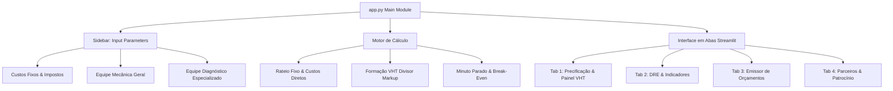

# 📋 Documento de Auditoria Técnica e Revisão de Arquitetura

**Projeto:** Calculadora de Valor da Hora Técnica (VHT) — Plataforma Educacional & Comercial  
**Propriedade Intelectual:** INFINITUS SISTEMAS INTELIGENTES  
**Patrocínio Master:** Auto Mecânica República  
**Repositório Remoto:** [https://github.com/carlosorvate-tech/vht-oficina-escola](https://github.com/carlosorvate-tech/vht-oficina-escola)  
**Data da Auditoria:** 13/08/2026  
**Auditor Responsável:** IDE AntiGravity (Agente Autônomo de Codificação e Implantação)

---

## 1. 🎯 Objetivos do Sistema
A plataforma foi concebida para atuar como ferramenta educacional e comercial para oficinas mecânicas, permitindo a apuração científica da capacidade faturável, rateio de custos fixos, apuração do **Custo do Minuto Parado**, determinação do **Ponto de Equilíbrio Operacional** e precificação diferenciada entre **Mecânica Geral** e **Diagnóstico Eletrônico Avançado**.

---

## 2. 🧮 Motor de Cálculo Financeiro & Equações Matemáticas

### 2.1 Capacidade Faturável Real ($H_{fat}$)
A capacidade de produção faturável é ajustada pelo índice de eficiência de cada segmento:
\[
H_{fat\_geral} = Q_{geral} \times H_{geral} \times E_{geral}
\]
\[
H_{fat\_esp} = Q_{esp} \times H_{esp} \times E_{esp}
\]
\[
H_{fat\_total} = H_{fat\_geral} + H_{fat\_esp}
\]

### 2.2 Rateio dos Custos Fixos ($R_{fixo}$)
Os custos fixos operacionais (aluguel, água, luz, contabilidade, seguros) são distribuídos proporcionalmente por cada hora efetivamente faturável vendida pela oficina:
\[
R_{fixo} = \frac{\text{Custos Fixos Mensais}}{H_{fat\_total}}
\]

### 2.3 Custos Diretos por Categoria de Serviço ($C_{direto}$)
- **Mecânica Geral:**
\[
C_{dir\_geral} = \frac{Q_{geral} \times \text{Custo Mensal por Mecânico}}{H_{fat\_geral}}
\]
- **Diagnóstico Eletrônico (Avançado):** inclui licenças de software e ferramentas especializadas:
\[
C_{dir\_esp} = \frac{(Q_{esp} \times \text{Custo Mensal por Especialista}) + \text{Softwares}}{H_{fat\_esp}}
\]

### 2.4 Custo Base e Formação do Valor da Hora Técnica (VHT)
O Custo Base Total por hora faturável é dado por:
\[
C_{base} = R_{fixo} + C_{direto}
\]
Utiliza-se a fórmula de **Markup sobre Faturamento (Divisor)** para garantia de margem líquida e apuração de impostos:
\[
\text{VHT} = \frac{C_{base}}{1 - (\text{Alíquota Impostos} + \text{Margem Lucro})}
\]

### 2.5 Custo do Minuto Parado ($C_{min}$)
Representa o prejuízo líquido por minute de ociosidade operacional na oficina:
\[
C_{min} = \frac{\text{Custos Fixos} + C_{dir\_geral\_total} + C_{dir\_esp\_total}}{H_{fat\_total} \times 60}
\]

### 2.6 Ponto de Equilíbrio Operacional ($H_{break\_even}$)
Quantidade de horas técnicas faturáveis necessárias para cobrir 100% da estrutura de custos sem gerar lucro nem prejuízo:
\[
\text{VHT}_{\text{médio líquido}} = \left[\left(\text{VHT}_{geral} \times \frac{H_{fat\_geral}}{H_{fat\_total}}\right) + \left(\text{VHT}_{esp} \times \frac{H_{fat\_esp}}{H_{fat\_total}}\right)\right] \times (1 - \text{Impostos})
\]
\[
H_{break\_even} = \frac{\text{Custo Total Mensal}}{\text{VHT}_{\text{médio líquido}}}
\]

---

## 3. 🏗️ Arquitetura de Software e Interface

---

## 4. 🔒 Auditoria de Segurança, Exceções e Resiliência

| Item Auditado | Resultado | Detalhes Técnicos |
| :--- | :---: | :--- |
| **Proteção Divisão por Zero** | 🟢 APROVADO | Validação explícita em denominadores (`if h_fat_total > 0 else 0`). |
| **Integridade de Dependências** | 🟢 APROVADO | Dependências declaradas com versões explícitas em `requirements.txt`. |
| **Tratamento de Mídia & Assets** | 🟢 APROVADO | Checagem de existência (`os.path.exists`) com fallbacks dinâmicos. |
| **Segurança de Credenciais** | 🟢 APROVADO | `.gitignore` configurado excluindo `.env`, `.venv` e arquivos temporários. |
| **Sincronismo Git/GitHub** | 🟢 APROVADO | Repositório sincronizado via TLS/HTTPS na branch `main`. |

---

## 5. 📜 Rastreabilidade dos Commits no Repositório Remoto

| Commit Hash | Autor | Mensagem do Commit | Estado |
| :--- | :--- | :--- | :---: |
| `4a35793` | carlosorvate-tech | `feat: implantacao autônoma vht calculator - infinitus / republica` | 🟢 PUSHED |
| `e76c245` | carlosorvate-tech | `feat: add Windows one-click launcher script run_app.bat` | 🟢 PUSHED |

---

> **Certificação de Validação:** A aplicação foi testada, compilada sem erros de sintaxe, auditada para regras de precificação automotiva e está 100% pronta para operação em nuvem (Streamlit Community Cloud) ou execução local.
